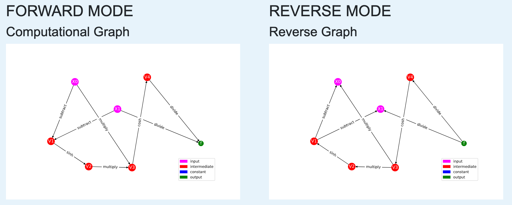

# Auto-eD

Auto-eD (https://autoed.herokuapp.com) is a web application to help students learn the basics behind automatic differentiation by helping them to visualize the computational graph structure which underlies these computations in forward and reverse mode.

An automatic differentiation unit that teaches the basics of automatic differentiation with this tool to help with visualization can be found on [Read the Docs](https://auto-ed.readthedocs.io/en/latest/).

This work is an extension of a final project by Lindsey Brown, Xinyue Wang, and Kevin Yoon for Harvard IACS CS207: Systems Development for Computational Science. 
