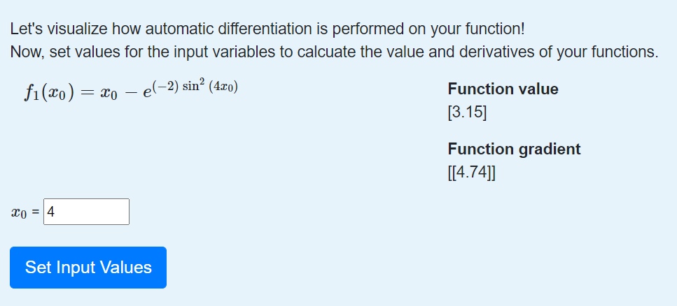

Module 1: The Basics of Forward Mode
====================================

Introduction
------------

Differentiation is a fundamental operation in computational science that is important in many applications, including optimization, sensitivity analysis, and solving differential equations.  To be useful in these applications, derivatives must be computed both precisely and efficiently.  **Automatic differentiation**, sometimes also called algorithmic differentiation or computational differentiation, is able to do both, distinguishing it from both numerical differentiation and symbolic differentiation.

* Automatic differentiation is not numerical differentiation.

*Numerical differentiation* refers to a class of methods that computes derivatives through finite difference formulae based on the definition of the derivative,

.. math::

        \frac{df(x)}{dx} = \lim_{h \rightarrow 0} \frac{f(x+h)-f(x)}{h}

Such methods are limited in precision due to truncation and roundoff errors as accuracy depends on choosing an appropriately sized h.  Let's consider a basic example.

Demo 1: Errors in The Finite Difference Method
^^^^^^^^^^^^^^^^^^^^^^^^^^^^^^^^^^^^^^^^^^^^^^

Let's consider the function :math:`x-\exp(-2\sin^2(4x))`.  Using our basic differentiation rules, we can compute the derivative symbolically,

.. math::

        \frac{df}{dx} = 1 + 16\exp(-2\sin^2(4x))\sin(4x)\cos(4x)

Let's write code to calculate derivatives using the finite difference method for this function.

::  

        #define our function
        def f(x):
            return x-np.exp(-2*np.sin(4*x)**2)
        
        #explicitly define the derivative to compare accuracy
        def dfdx(x):
            return 1+16*np.exp(-2*np.sin(4*x)**2)*np.sin(4*x)*np.cos(4*x)

        #get numerical derivative at x for stepsize h
        def finite_diff(f, x, h):
            return (f(x+h)-f(x))/h

        #explore accuracy when changing h
        x = np.linspace(0, 2, 1000)
        hs = np.logspace(-13, 1, 1000)

        errs = np.zeros(len(hs))

        for i, h in enumerate(hs):
            err = finite_diff(f, x, h)-dfdx(x) # compute error at each domain point
            errs[i] = np.linalg.norm(err) # store L2 norm of error

        #make plot of the error
        fig, ax = plt.subplots(1,1, figsize=(10,6))
        ax.plot(hs, errs, lw=3)
        ax.set_xscale('log')
        ax.set_yscale('log')
        ax.set_xlabel('h', fontsize=24)
        ax.set_ylabel(r'$\|f^{\prime}_{FD}-f^{\prime}_{exact}\|_{L_2}$')
        ax.tick_params(labelsize=24)
        plt.tight_layout()

The code producing the following plot, showing the effects of the choice of h on the accuracy of the finite difference method.

.. image::
        hEffect.png

In the above, we see that the accuracy of the derivative calculation is highly dependent on our choice of h.  When we choose h too large, the numerical approximation is no longer accurate, but for h too small, we begin to see round off errors from limitations in machine precision.

See Exercise 1 for another example motivating the use of automatic differentiation.

* Automatic differentiation is not symbolic differentiation.

*Symbolic differentiation* computes exact expressions for derivatives using expression trees.  As seen in the function in Demo 1, exact expressions for derivatives can quickly become complex, making computing derivatives in this manner computationally inefficient.

* Automatic differentiation is a procedure that computes derivatives to machine precision without explicitly forming an expression for the derivative by employing the ideas of the chain rule to decompose complex functions into elementary functions for which we can compute the derivative exactly.

Automatic differentiation may perform this process through two different modes, forward and reverse, both allowing for efficient and accurate computation of derivatives.  These properties make automatic differentiation useful in a variety of applications including machine learning, parameter optimization, sensitivity analysis, physical modeling, and probabilistic inference.  In the rest of this module, we will explore the underlying theory that allows automatic differentiation to be applied in such a wide variety of applications.

The Basics of Forward Mode
--------------------------
The major theoretical concept underlying automatic differentiation is *the chain rule*.  Recall from calculus that the chain rule states that to find the derivative of composition of functions, we multiply a series of derivatives; let f(t) = g(h(t)).  We have

.. math::

        \frac{df}{dt} = \frac{dg}{dh}\frac{dh}{dt}

This can be generalized to functions of multiple inputs, which we will discuss in more detail in Unit 2.

Elementary Functions
^^^^^^^^^^^^^^^^^^^^
Every function can be decomposed into a series of binary elementary operations or unary functions.  These elementary operations include addition, subtraction, multiplication, division, and exponentiation.  Elementary functions include the natrual exponential and natural logarithm, trigonometric functions, and hyperbolic trigonometric functions.  From basic calculus, we know closed form differentiation rules for these elementary functions.  This means that we can compose these functions to form more complex functions and find the derivative of these more complex functions using the chain rule.  To understand this composition from elementary functions, we can think of the composition of functions as having an underlying graph structure.

A Tool for Visualizing Automatic Differentiation
------------------------------------------------
The Auto-eD tool is a pedagogical tool to help visualize the processes underlying automatic differentiation.  In particular, this tool allows us to visualize the underlying graph structure of a calculation when decomposed into elementary functions.  In addition to helping to visualize this graph, the tool can also be used to view the computational traces that occur at each node of the graph which will be discussed in more detail in Unit 2.

Installation
^^^^^^^^^^^^
The tool can be downloaded by  TO DO: FIND CUTE WAY TO LAUNCH

Developer Instructions
^^^^^^^^^^^^^^^^^^^^^^
To run the tool with the ability to modify and contribute to the code, you may choose to clone the github repo to have direct access to the code for the web app and access to the underlying package.  From the terminal,

1. Clone the repo: git clone https:github.com/lindseysbrown/Auto-eD

2. Install the dependencies: pip install -r requirements.txt

3. Launch the web app from the terminal: python ADapp_embed.py

4. Go to the local host in your browser to use the tool.

If you would like to contirbute to this project, you can do so by making a pull request and the developers will respond to you.

A First Demo of Automatic Differentiation
-----------------------------------------
Let's use the tool to visualize the function from our first demo.

1. The function has a single input variable, x, so we enter that our function has 1 input into the tool.   
2. Our function is scalar valued so we enter that our function has 1 output.

.. image:: 
        Step1.PNG

3. We use the calculator interface to enter our function.  (Note that we can use the backspace key or the "Clear All" button to correct the function if we make a mistake when entering it.)

.. image:: 
        Step2.PNG
        
4. Press the "Calculate" button.  This will move you to a new screen with options to help you visualize both the forward and reverse mode of automatic differentiation.
5. Enter the value for x at which you'd like to evaluate the function.  For the purposes of this demo, we'll choose x=4.  Hit the "Set Input Values" button.
6. You'll see the values for the function and derivative appear below the input values you selected.

7. Below this, you'll see buttons for which function you'd like to visualize.  In this example, we only have a single function, so press f1.
8. This will generate the computational graph for both forward and reverse mode as well as the computational table.  We'll talk more about the computational table and reverse mode in the next units, so for now let's just focus on the computational graph in forward mode.

.. image:: Step4.PNG

9. Notice that there is a single magenta node, representing our single input to the function, and a single green output node, the output value of our function.  The red nodes represent intermediate function values.  Notice that all of the nodes are connected by elementary operations on the labelled edges.  (Hint: Occasionally the graphs may be difficult to read depending on the complexity of the function that you are visualizing.  You can try running the tool a second time to get a different configuration of the nodes.  Alternatively, for large functions, you can use the underlying package which will generate graphs that you can maximize to resize the edges.)

Some Key Takeaways
^^^^^^^^^^^^^^^^^^
* Our function was decomposed into a series of elementary operations
* These operations include both basic binary operations (addition, subtraction, multiplication, and division) and unary operations (exponential functions, trigonometric functions)
* Using this graph to compute the derivative is the same process as using the chain rule to compute the derivative, allowing the derivative to be computed to machine precision

Exercises
---------
Exercise 1: Motivating Automatic Differentiation
^^^^^^^^^^^^^^^^^^^^^^^^^^^^^^^^^^^^^^^^^^^^^^^^
A. Write a function that takes as inputs a function (of a single variable) and a value of h and returns a function which takes as input a value of x and computes the numerical approximation of the derivative of f with stepsize h at x.  (For those coding in python, this function can be written as a closure.)

B.  Let :math:`f(x) = ln(x)`.  For :math:`0.2\leq x \leq 0.4`, make a plot comparing the numerically estimated derivative for h=1e-1, h=1e-7, and h=1e-15 to the analytic derivative (which should be used explicitly).

C.  Answer the following questions:

* Which value of h most closely approximates the true derivative?  What happens for values of h that are too small?  What happens for values of h that are too large?
* How does automatic differentiation address these problems?

Exercise 2: Basic Graph Structure of Calculations
^^^^^^^^^^^^^^^^^^^^^^^^^^^^^^^^^^^^^^^^^^^^^^^^^
Consider the function :math:`f(x)= \tan(x^2+3)+x`.

Try drawing the graph by hand.  Compare results to that using the visualization tool.

Exercise 3: Looking Toward Multiple Inputs
^^^^^^^^^^^^^^^^^^^^^^^^^^^^^^^^^^^^^^^^^^
We can use the same process to compute derivatives for functions of multiple inputs.  Consider the function,

.. math::
        f(x,y)=\exp(-(\sin(x)-\cos(y))^2)

Practice drawing the computational graph for this function.  We'll discuss the theory behind functions of multiple inputs in the next unit.
