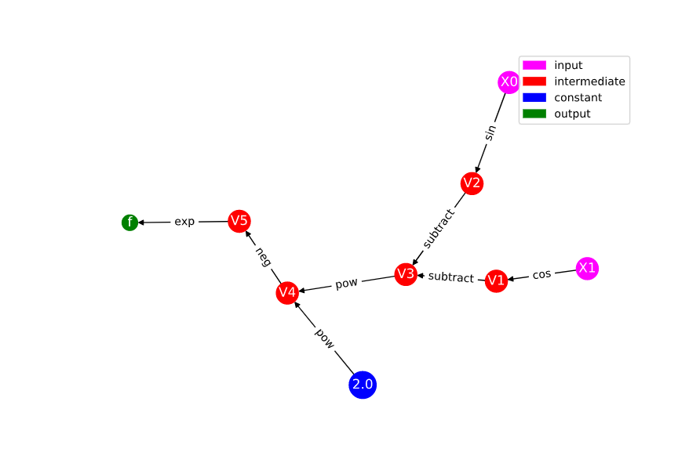
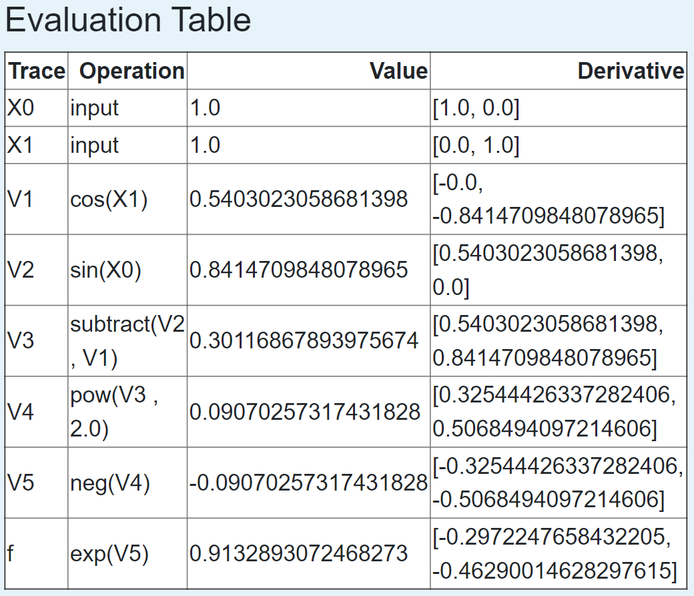

Module 2: Deeper Into Forward Mode
==================================

As we introduced in Module 1, the forward mode of automatic differentiation computes derviatives by decomposing functions
into a series of elementary operations.  We can explicitly compute the derivative of each of these elementary operations,
allowing us to combine them using the chain rule to accurately compute the derivative of our function.  As we have seen, in
the computational graph, nodes represent inputs and outputs of elementary operations, and the edges correspond to the
elementary operations that join these nodes.  The inputs to our functions become the first nodes in our graph.  For each
subsequent node, we can consider an evaluation and derivative up to that point in the graph, allowing us to consider the
computation as a series of elementary traces.

The Computational Trace and Practice with the Visualization Tool
----------------------------------------------------------------
At each step in the graph, we can consider the current function value and derivative up to that node.  Using the chain rule,
we compute the derivative at a particular node from the elementary operation that created that node and the value and
derivative of the input node to that elementary operation.  We'll return to our example from the first demo in a moment. For
now, let's work with a simpler function so we can see example how everything works out. 

A Basic Example
^^^^^^^^^^^^^^^
We worked with a fairly involved function in module 1. Now we want to understand how the graph is created an how derivatives
are really computed using automatic differentiation. A very friendly function to start with is,

.. math::
        f(x) = \sin(2x)

Evaluating the Function
"""""""""""""""""""""""
We want to evaluate :math:`f(x)` at a specific point. We will choose the point `a=2`. Throughout this documentation, we will
refer to a specific point with the name `a`. It should be assumed that `a` has a specific value (e.g. `2`). How do we
evaluate this function?

1. Replace `x` with the value `2`.

2. Multiply: :math:`2\times 2 = 4`.

3. Apply the sine function: :math:`\sin(4)`

4. Return the value of f: :math:`f = \sin(4)`.

Visualizing the Evaluation
""""""""""""""""""""""""""
We can visualize this evaluation in a graph. Each node of the graph will represent a stage in evaluation of the function. The
nodes are connected together with edges. The parent value of a given node is the input to that node. The input to the entire
function will be dentoed by :math:`x_{0}`. Intermediate values will be denoted by :math:`v_{i}`. The evaluation graph of our
simple function is show in the figure below.

.. image:: simple_graph.PNG

We can convert this graph picture into a trace table, which "traces" out the computational steps. The trace table for this
function is shown in the following table.

.. list-table::
        :widths: 10 25 25
        :header-rows: 1
        
        * - Trace
          - Elementary Function
          - Current Value
        * - :math:`x_1`
          - x, input
          - :math:`2`
        * - :math:`v_1`
          - :math:`2x_1`
          - :math:`4`
        * - :math:`v_2`
          - :math:`\sin(v_1)`
          - :math:`\sin(4)`

This table makes a connection between the evaluation that we normally do and the graph that we used to help us visualize the
function evaluation. So far there is nothing much new. These calculations are done almost automatically by our brains and by
the computer. All we've done so far is laid things out more algorithmically.

Introducing Derivatives
"""""""""""""""""""""""
Let's add one more wrinkle. We can actually compute the derivatives as we go along at each step. The way we do this is by
applying the chain rule at each step. We'll had two more columns to the table. The first new column will represent the
elementary function derivative at that step. The second new column will represent the value of the derivative at that step.

.. list-table::
        :widths: 10 25 25 25 20
        :header-rows: 1
        
        * - Trace
          - Elementary Function
          - Current Value
          - Elementary Function Derivative
          - Current Derivative Value
        * - :math:`x_1`
          - x, input
          - :math:`2`
          - :math:`1`
          - :math:`1`
        * - :math:`v_1`
          - :math:`2x_1`
          - :math:`4`
          - :math:`2\dot{x}_1`
          - :math:`2`
        * - :math:`v_2`
          - :math:`\sin(v_1)`
          - :math:`\sin(4)`
          - :math:`\cos(v_1)\dot{v}_{1}`
          - :math:`\cos(4)\cdot 2`

The first thing to observe is that the derivative value of the output is precisely what we would expect it to be. The
derivative of our function is :math:`f^{\prime} = 2\cos(2x)`. Evaluated at our chosen point, this is :math:`f^{\prime} =
2\cos(4)`. So whatever we did in the table seemed to have worked.

We introduced some new notation: we denoted a derivative with the overdot notation. This is the common notation in
forward mode. Therefore, the derivative of :math:`2x_{1}` is simply :math:`2\dot{x}_{1}`. The dot should be interpreted as a
derivative with respect to the independent variable. In the 1D case that we're doing here, the dot means a derivative with
respect to `x`.

We used the chain rule at each step. This is most apparent in the last step where we took the derivative of :math:`v_{2}` to get
:math:`\dot{v}_{2}`, which is just :math:`f^{\prime}` in this case.

Finally, there is something interesting about how we set the initial derivative in the first step. What we have done is
"seeded" the derivative. Intuitively, it may help to think that in the first step we are taking the derivative of the input
with respect to itself. Since :math:`dx/dx=1`, the derivative in the first step should just be one. However, we will see
later that this is actually not necessary. If we want to get the true derivative, then it is good to seed the derivative in
this way. However, automatic differentiation is more powerful than this and choosing different seed values can give valuable
information. Stay tuned.

For this simple example, we can draw an accompanying graph to the original computational graph, which helps us visualize the
way derivatives are carried through.

.. image:: simple_deriv_graph.PNG

The new graph shadows the original graph. Each node in the shadow graph represents the derivative at that step. Note that the
edges representing the elementary functions (in this case sine) have been differentiated. Note too how the derivatives from
the previous node feed *forward* to the next node.

The Original Demo
^^^^^^^^^^^^^^^^^
Now we return to the original demo from the first module.

.. math::
        f(x) = x - \exp(-2\sin^2(4x))

In module 1, we formed the corresponding computational graph. Now let's use that graph to write the computational table. Each
node in the table is the output of an elmentary function, whose derivative we can compute explicitly.

.. list-table::
        :widths: 10 25 25 25 25
        :header-rows: 1
        
        * - Trace
          - Elementary Function
          - Current Value
          - Elementary Function Derivative
          - Derivative Evaluated at x
        * - :math:`x_1`
          - x, input
          - :math:`\frac{\pi}{16}`
          - 1
          - 1
        * - :math:`x_2`
          - :math:`4x_1`
          - :math:`\frac{\pi}{4}`
          - :math:`4\dot{x_1}`
          - 4
        * - :math:`x_3`
          - :math:`\sin(x_2)`
          - :math:`\frac{\sqrt{2}}{2}`
          - :math:`\cos(x_2)\dot{x_2}`
          - :math:`2\sqrt{2}`
        * - :math:`x_4`
          - :math:`x_3^2`
          - :math:`\frac{1}{2}`
          - :math:`2x_3\dot{x_3}`
          - 4
        * - :math:`x_5`
          - :math:`-2x_4`
          - 1
          - :math:`-2\dot{x_4}`
          - -8
        * - :math:`x_6`
          - :math:`exp(x_5)`
          - :math:`\frac{1}{e}`
          - :math:`exp(x_5)\dot{x_5}`
          - :math:`\frac{-8}{e}`
        * - :math:`x_7`
          - :math:`-x_6`
          - :math:`\frac{-1}{e}`
          - :math:`-\dot{x_6}`
          - :math:`\frac{8}{e}`
        * - :math:`x_8`
          - :math:`x_1 + x_7`
          - :math:`\frac{\pi}{16}-\frac{1}{e}`
          - :math:`\dot{x_1}+\dot{x_7}`
          - :math:`1+\frac{8}{e}`
        
          

The visualization tool which we installed in the first unit also computes the computational table. Input the function and
compare the forward mode graph to the forward model table.

Notice how the computational trace corresponds to the nodes on the graph and the edges linking these nodes. Note that the
choices of labels for the traces might be different than the table we wrote by hand - compare the labels for the nodes in the
graph.

Multiple Inputs
^^^^^^^^^^^^^^^
Now let's consider an example with multiple inputs. The computed derivative is now the gradient vector. Instead of
maintaining an evaluation trace of a scalar derivative for a single input, we instead have a trace of the gradient for
multiple inputs. 

In the exercises in the previous module, we practiced drawing the graph for the function

.. math::
        f(x,y) = \exp(-(\sin(x)-\cos(y))^2).

Try to draw the graph by hand. The graph you drew should have the same structure as the graph below, which was produced with
the visualization tool (with the exception of possibly interchanging some of the labels).

We can also use the visualization tool to see the computational table which corresponds to the graph. Observe that the
derivative in our table is now a 2 dimensional vector, corresponding to the gradient, where each component is the derivative
with respect to one of our inputs. Also notice that this table does not include the columns for the elementary function or
its derivative. Those columns are useful for learning how things work, but ultimately automatic differentiation does not need
to store them; it only needs to store the value. Note too that the interpretation of :math:`\dot{x}` must be generalized. The
dot now represents a derivative with respect to one or the other input depending on the context. Lastly, the table does not
include any symbolic numbers. Instead, it presents values with as much precision as the computer allows to emphasize that
automatic differentiation computes derivatives to machine precision.

Note that computing the gradient for this multivariate function is done by assigning a seed vector to each input, where to
find the gradient we use the standard basis vectors as seeds.  We'll discuss more about what this means automatic
differentiation is computing in the next section.

More Theory
-----------
The Multivariate Chain Rule
^^^^^^^^^^^^^^^^^^^^^^^^^^^
As we saw in the example above, we can use automatic differentiation to find the gradient of functions with multiple inputs.
From multivariate calculus, recall that we can find the derivative of a function with multiple inputs also using the chain
rule.  Let :math:`g(t) = h(u(t), v(t))`.

.. math::

        \frac{dg}{dt} = \frac{dh}{du}\frac{du}{dt} + \frac{dh}{dv}\frac{dv}{dt}.

We can write this in general form as

.. math::
        
        \nabla_x h = \sum_{i=1}^n \frac{\partial h}{\partial y_i}\nabla_x y_i

Using this formula allows us to compute the partial derivatives for each input as we saw in the evaluation trace in our multivariate example. 

     
What Does Forward Mode Compute?
^^^^^^^^^^^^^^^^^^^^^^^^^^^^^^^
At each evaluation step, the forward mode propagates the derivative to the next node using the chain rule to evaluate the derivative from the previous node and the elementary operation.  Notice that we do not need to store all of the values at each node in memory, but instead, we only need to store value and derivative values until all of the children of a node have been evaluated.

If we consider the most general case, we are interested in computing Jacobians of vector valued functions of multiple variables.  To compute these individual gradients, we started our evaluation table with a seed vector, p.  This allows us to consider directional derivatives, :math:`D_p x_k = \sum dx_3/dx_j p_j`, so we find that forward mode actually computes directional derivatives and when we choose our seed vectors to be standard unit vectors, we attain the standard gradient.  Extending this to vector valued functions, we have that forward mode computes :math:`Jp`, a Jacobian vector product.

How Efficient is Forward Mode?
^^^^^^^^^^^^^^^^^^^^^^^^^^^^^^
From this analysis of what forward mode computes, we see that the efficiency of forward mode depends on the number of input variables.  Thus, forward mode will be less efficient when we have a large number of input variables.

Exercises
---------
Neural Network Problem
^^^^^^^^^^^^^^^^^^^^^^
Artificial neural networks take as input the values of an input layer of neurons and combine these inputs in a series of layers to compute an output.  A small network with a single hidden layer is drawn below.

.. image::
        NNFigNoPhi.png

The network can be expressed in matrix notation as

.. math::
        f(x,y) = w_{out}^Tz\left(W\begin{bmatrix} x \\ y \end{bmatrix} + \begin{bmatrix}b_1 \\ b_2 \end{bmatrix}\right)+b_{out}

where

.. math::
        W = \begin{bmatrix} w_{11} & w_{12} \\ w_{21} & w_{22}\end{bmatrix}

is a (real) matrix of weights, and

.. math::
        w_{out} = \begin{bmatrix}w_{out,1} \\ w_{out,2}\end{bmatrix}

is a vector representing output weights, :math:`b_i` are bias terms and :math:`z` is a nonlinear function that acts component wise.

The above graph helps us visualize the computation in different layers.  This visualization hides many of the underlying operations which occur in the computation of :math:`f` (e.g. it does not explicitly express the elementary operations).

Your tasks:
In this part, you will completely neglect the biases.  The mathematical form is therefore

.. math::
        f(x,y) = w_{out}^Tz\left(W\begin{bmatrix}x \\ y \end{bmatrix}\right)

Note that in practical applications the biases play a key role.  However, we have elected to neglect them in this problem so that your results are more readable.  You will complete the two steps below while neglecting the bias terms.

1. Draw the complete forward computational graph.  You may treat :math:`z` as a single elementary operation.  You should explicitly show the multiplications and additions that are masked in the schematic of the network above.
2. Use your graph to write out the full forward mode table, including columns for the trace, elementary function, current function value, elementary function, derivative, partial x derivative, and partial y derivative.

Operation Count Problem
^^^^^^^^^^^^^^^^^^^^^^^
Count the number of operations required to compute the derivatives in the neural network using forward mode.
