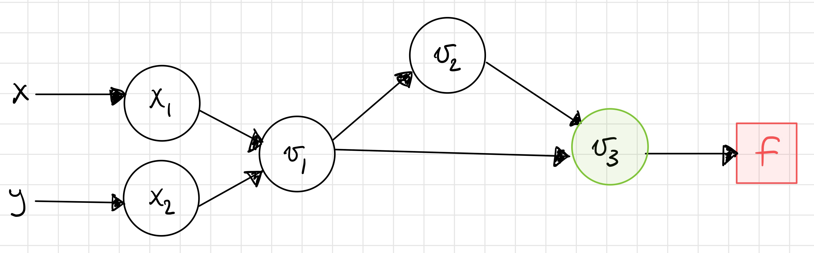
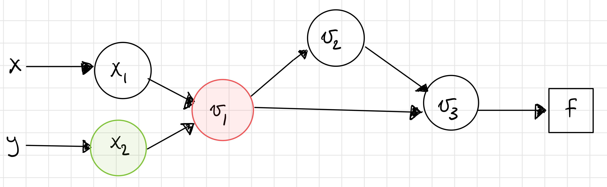
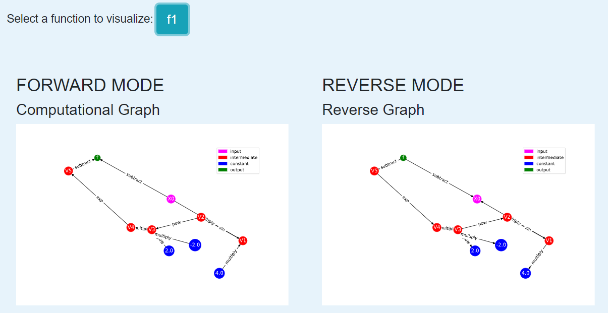

Module 3: The Reverse Mode of Automatic Differentiation
=======================================================
So far we have considered one mode of automatic differentiation, the forward mode.  In forward mode, we carried derivatives along
as we traversed the graph so that the graph itself did not need to be explicitly stored in memory. 

In reverse mode, we build the graph and store partial derivative information at each node but do not compute the full derivative with the chain rule
until the backward pass of the graph. We will see that both approaches have computational advantages over each other for
different types of problems.

I. The Basics of Reverse Mode
-----------------------------
As in forward mode, reverse mode still relies on the underlying computational graph structure of functions. As we will see
using the visualization tool, the same graph can be used for forward and reverse mode, but what is different is the direction that derivative
information is propagated. Recall that in forward mode, we passed derivative information forward to store the
derivative at each node.

In reverse mode, instead of storing full derivative information at each node, *only the partial derivatives of nodes relative
to its children are stored*.  For example, if node :math:`x_3` has inputs nodes :math:`x_1` and :math:`x_2`, only the partial
derivatives :math:`\frac{\partial x_3}{\partial x_1}` and :math:`\frac{\partial x_3}{\partial x_2}` are stored. Contrast
this with forward mode, where for a function with inputs :math:`x` and :math:`y`, this node would store :math:`\frac{\partial x_3}{\partial
x}` and :math:`\frac{\partial x_3}{\partial y}` via the chain rule.

The reverse mode consists of two passes through the graph. The forward pass first builds the computational graph while
storing just the partial derivative information. The reverse pass then starts at the output node and traverses the graph in
the reverse direction to find the full partial derivatives. 

The "bar notation" is commonly used to denote our backward pass tangents, :math:`\bar{x_i} = \frac{\partial f}{\partial
x_i}`. These are sometimes also called the adjoint variable.  At the final node in the graph, :math:`f = x_N`, we have
:math:`\bar{x_N} = \frac{\partial f}{\partial x_N} = 1`. We then traverse backward through the graph to construct the partial
derivative from the chain rule. :math:`\bar{x_{N-1}}  = \bar{x_N}\frac{\partial x_N}{\partial x_{N-1}}`. Note that the
partial derivative is exactly the value that has already been stored by the forward pass of the graph.

This process is relatively straightforward for nodes with only one child. When we encounter nodes with multiple children, we
must perform a summation over the children, which follows directly from the multivariate chain rule.

For :math:`x_i` with children :math:`x_j` and :math:`x_k`, we have

.. math::
        \bar{x_i} = \bar{x_j}\frac{\partial x_j}{\partial x_i} + \bar{x_k}\frac{\partial x_k}{\partial x_i}.

II. Summary Sketch of Reverse Mode
----------------------------------

1. Create the evaluation graph
2. The forward pass does function evaluations
3. The forward pass also saves the partial derivatives of the elementary function at each step
    - **It does not do the chain rule!**
    - It only stores the partial derivatives
    - Examples:
        * If :math:`v_3 = v_1 v_2` is a node, then we store :math:`\dfrac{\partial v_3}{\partial v_1}` and
          :math:`\dfrac{\partial v_3}{\partial v_2}`. That's it.
        * If :math:`v_3 = \sin(v_2)` is a node, then we store :math:`\cos(v_2)`. Notice that there is no :math:`\dot{v}_{2}`.
4. The reverse pass starts with :math:`\overline{v}_{N} = \dfrac{\partial f}{\partial v_{N}} = 1` (since :math:`f` is :math:`v_{N}`).
5. Next, the reverse pass gets :math:`\overline{v}_{N-1} = \dfrac{\partial f}{\partial v_{N}}\dfrac{\partial v_{N}}{\partial v_{N-1}}`.
    - **Note:** :math:`\dfrac{\partial v_{N}}{\partial v_{N-1}}` is already stored from the forward pass.
6. The only trick occurs when we get to a branch in the graph. That is, when the node we're on has more than one child. In
  that case, we sum the two paths. For example, if :math:`v_3` has :math:`v_4` and :math:`v_5` as children, then we do:

    .. math::
            \overline{v}_{3} = \dfrac{\partial f}{\partial v_{3}} = \dfrac{\partial f}{\partial v_{4}}\dfrac{\partial
            v_{4}}{\partial v_{3}} + \dfrac{\partial f}{\partial v_{5}}\dfrac{\partial v_{5}}{\partial v_{3}}

    - **Note:** This summation is a manifestation of the chain rule.

III. The Basic Equations
------------------------

The partial derivative of :math:`f` with respect to :math:`u_{i}` can be written as (see `Nocedal and Wright <refs.html>`_, pg. 180):

.. math::
        \dfrac{\partial f}{\partial u_{i}} = \sum_{j\text{ a child of } i}{\dfrac{\partial f}{\partial u_{j}}\dfrac{\partial
        u_{j}}{\partial u_{i}}}.

At each node :math:`i` we compute

.. math::
        \overline{u}_{i} += \dfrac{\partial f}{\partial u_{j}}\dfrac{\partial u_{j}}{\partial u_{i}}.

The :math:`\overline{u}_{i}` variable stores the current value of the partial derivative at node :math:`i`. As mentioned
previously, it is sometimes called the adjoint variable.

Note that in our notation :math:`u_{i}` could be an input variable (e.g. :math:`x_{i}`) or an intermediate variable (e.g.
:math:`v_{i}`).

IV. An Example for Intuition
----------------------------

Let's try to evaluate the function 

.. math::
        f(x,y) = xy + \exp(xy)

and its gradient at the point :math:`(1,2)`. We'll use reverse mode this time. Here is a picture of the computational graph,

.. image::
         Reverse-Example.PNG

and the corresponding table,

.. image::
         Reverse-Example-Table.PNG

Step 1
""""""

The first step is to generate the forward trace and calculate the partial derivatives of a node with respect to its
children. Note that this time we must save the graph.

Step 2
""""""

Next, we start at :math:`v_{3}` and start calculating the chain rule. We have 

.. math::
        \overline{v}_{3} = \dfrac{\partial f}{\partial v_{3}} = 1.

Step 3
""""""

.. math::
        \overline{v}_{2} = \dfrac{\partial f}{\partial v_{3}}\dfrac{\partial v_{3}}{\partial v_{2}} = 1 \cdot 1 = 1.

.. image::
         v2.PNG

Step 4
""""""

.. math::
        \overline{v}_{1} = \dfrac{\partial f}{\partial v_{3}}\dfrac{\partial v_{3}}{\partial v_{1}} + \dfrac{\partial
          f}{\partial v_{2}}\dfrac{\partial v_{2}}{\partial v_{1}}= 1 \cdot 1 + 1 \cdot e^{2} = 1 + e^{2}.

Note that we had to do a sum over the childen this time!

.. image::
         v1.PNG

Step 5
""""""

.. math::
        \overline{x}_{2} = \dfrac{\partial f}{\partial v_{1}}\dfrac{\partial v_{1}}{\partial x_{2}} = (1 + e^{2})x_{1} = 1 +
         e^{2} = \dfrac{\partial f}{\partial y}.

Step 6
""""""

.. math::
        \overline{x}_{1} = \dfrac{\partial f}{\partial v_{1}}\dfrac{\partial v_{1}}{\partial x_{1}} = (1 + e^{2})x_{2} = 2 +
         2e^{2} = \dfrac{\partial f}{\partial x}.

.. image::
         x1.PNG

You should check that these results match those from taking the symbolic derivative and evaluating it at the desired point.

V. Practice with the Visualization Tool
---------------------------------------
Let's revisit our typical example. As with forward mode, we input the function into the interface in the same way and can
compute the function value and derivative, but now we know a little bit about what reverse mode computes. 

Let's start with the same example we analyzed for forward mode, :math:`f(x) = x-\exp(-2\sin(4x)^2)`. Input it into the visualization tool in
the same way that you did in the `first module <mod1.html#iv-a-first-demo-of-automatic-differentiation>`_.

This time, focus on the right half of the visualization page. At the top right, you'll see a graph that looks very similar to the one
produced in forward mode. Notice that the only difference is the direction of the arrows, representing the fact that
derivatives are propagated in different directions.

Now let's dynamically visualize the process of reverse mode. In the bottom right, press the "df/dx" button. Use the "Next"
button to step through the process of reverse mode. At each step, the edge that the computation traverses is highlighted. 

Try the example with a function with multiple inputs, :math:`f(x,y) = xy+\exp(xy)`. Recall that this function has a branch in its underlying
graph structure. This time when dynamically visualizing the reverse mode, you should see that the computation has to trace
through both branches to pick up the stored partial derivatives for the computation of the derivatives.

**Key Takeaways**

- Reverse mode and forward mode propagate the derivative in different directions.
- The underlying graph structure of the function is the same for both modes of automatic differentiation.
- Reverse mode computes derivatives by making a backward pass starting at the output.

VI. More Theory
---------------
In the previous module, we demonstrated that forward mode computes the Jacobian vector product :math:`Jp`. In contrast,
reverse mode computes :math:`J^Tp` where :math:`J^{T}` is the transpose of the Jacobian. This seemingly small difference can
result in different operation counts for different kinds of problems.

Comment
"""""""
Backpropagation is a special case of the reverse mode of automatic differentiation where the function in which we are
interested in taking derivatives is a scalar function that represents the error between the output and the true value.

VII. A Comparison of Forward and Reverse Mode
---------------------------------------------
As the names suggest, the primary difference between forward and reverse mode is the direciton in which the computational
graph is traversed, as we saw with the visualization tool. This has implications for the computational efficiency of the two
approaches.

As we just stated, reverse mode computes :math:`J^Tp`, while in `Module 2 <mod2.html#what-does-forward-mode-compute>`_, we learned that forward mode computes :math:`Jp`.
Although we didn't go too deep into it, the implication of this difference is that reverse mode will be more efficient (require fewer operations) for functions with a fewer number of outputs and many inputs, while forward mode will be more efficient for functions with many outputs and fewer inputs.

Demo: A Comparison of Forward and Reverse Mode
""""""""""""""""""""""""""""""""""""""""""""""

Consider the function :math:`f(w_1, w_2, w_3, w_4, w_5) = w_1w_2w_3w_4w_5`. We want to compare the process of computing the
partial derivatives in forward and reverse mode at the point :math:`(2, 1, 1, 1, 1)`.  Let's start with reverse mode, where
we do not store the results of the chain rule but just the values of the partial derivatives at each step.

.. list-table::
        :widths: 10 10 10 10 10 10 10
        :header-rows: 1

        * - Node
          - Current Value
          - Numerical Value
          - :math:`\partial_1`
          - :math:`\partial_1` Value
          - :math:`\partial_2`
          - :math:`\partial_2` Value
        * - :math:`x_1`
          - :math:`x_1`
          - 2
          - 1
          - 1
          - -
          - -
        * - :math:`x_2`
          - :math:`x_2`
          - 1
          - 1
          - 1
          - -
          - -
        * - :math:`x_3`
          - :math:`x_3`
          - 1
          - 1
          - 1
          - -
          - -
        * - :math:`x_4`
          - :math:`x_4`
          - 1
          - 1
          - 1
          - -
          - -
        * - :math:`x_5`
          - :math:`x_5`
          - 1
          - 1
          - 1
          - -
          - -
        * - :math:`x_6`
          - :math:`x_4x_5`
          - 1
          - :math:`x_5`
          - 1
          - :math:`x_4`
          - 1
        * - :math:`x_7`
          - :math:`x_3x_6`
          - 1
          - :math:`x_6`
          - 1
          - :math:`x_3`
          - 1
        * - :math:`x_8`
          - :math:`x_2x_7`
          - 1
          - :math:`x_7`
          - 1
          - :math:`x_2`
          - 1
        * - :math:`x_9`
          - :math:`x_1x_8`
          - 2
          - :math:`x_8`
          - 1
          - :math:`x_1`
          - 2

To compute the derivatives, we will now traverse through the graph, picking up the partial derivatives, using our update
equations. You can visualize this graph traversal by using the dynamic visualization tool.

.. math::
        
        \bar{x_9} &= \frac{\partial f}{\partial x_9} = 1
        
        \bar{x_8} &= \frac{\partial f}{\partial x_9}\frac{\partial x_9}{\partial x_8} = 1 \cdot 2 = 2
        
        \bar{x_7} &= \frac{\partial f}{\partial x_8}\frac{\partial x_8}{\partial x_7} = 2 \cdot 1 = 2
        
        \bar{x_6} &= \frac{\partial f}{\partial x_7}\frac{\partial x_7}{\partial x_6} = 2 \cdot 1 = 2
        
        \bar{x_5} &= \frac{\partial f}{\partial x_6}\frac{\partial x_6}{\partial x_5} = 2 \cdot 1 = 2
        
        \bar{x_4} &= \frac{\partial f}{\partial x_6}\frac{\partial x_6}{\partial x_4} = 2 \cdot 1 = 2
        
        \bar{x_3} &= \frac{\partial f}{\partial x_7}\frac{\partial x_7}{\partial x_3} = 2 \cdot 1 = 2
        
        \bar{x_2} &= \frac{\partial f}{\partial x_8}\frac{\partial x_8}{\partial x_2} = 2 \cdot 1 = 2
        
        \bar{x_1} &= \frac{\partial f}{\partial x_9}\frac{\partial x_9}{\partial x_1} = 1 \cdot 1 = 1

As we learned in the previous module, we could have used forward mode to compute the same values. We know that we can use the
same graph structure for both directions, so let's compare the computational table for forward mode.

.. list-table::
        :widths: 5 10 10 10 5 5 5 5 5
        :header-rows: 1

        * - Node
          - Elementary Function
          - Numerical Value
          - Derivative
          - :math:`\partial_1`
          - :math:`\partial_2`
          - :math:`\partial_3`
          - :math:`\partial_4`
          - :math:`\partial_5`
        * - :math:`x_1`
          - :math:`x_1`
          - 2
          - :math:`\dot{x_1}`
          - 1
          - 0
          - 0
          - 0
          - 0
        * - :math:`x_2`
          - :math:`x_2`
          - 1
          - :math:`\dot{x_2}`
          - 0
          - 1
          - 0
          - 0
          - 0
        * - :math:`x_3`
          - :math:`x_3`
          - 1
          - :math:`\dot{x_3}`
          - 0
          - 0
          - 1
          - 0
          - 0
        * - :math:`x_4`
          - :math:`x_4`
          - 1
          - :math:`\dot{x_4}`
          - 0
          - 0
          - 0
          - 1
          - 0
        * - :math:`x_5`
          - :math:`x_5`
          - 1
          - :math:`\dot{x_5}`
          - 0
          - 0
          - 0
          - 0
          - 1
        * - :math:`x_6`
          - :math:`x_4x_5`
          - 1
          - :math:`x_4\dot{x_5}+\dot{x_4}x_5`
          - 0
          - 0
          - 0
          - 1
          - 1
        * - :math:`x_7`
          - :math:`x_3x_6`
          - 1
          - :math:`x_3\dot{x_6}+\dot{x_3}x_6`
          - 0
          - 0
          - 1
          - 1
          - 1
        * - :math:`x_8`
          - :math:`x_2x_7`
          - 1
          - :math:`x_2\dot{x_7}+\dot{x_2}x_7`
          - 0
          - 1
          - 1
          - 1
          - 1
        * - :math:`x_9`
          - :math:`x_1x_8`
          - 2
          - :math:`x_1\dot{x_8}+\dot{x_1}x_8`
          - 1
          - 2
          - 2
          - 2
          - 2

Both methods require 4 multiplication steps. Now consider the operations to compute the partial derivatives.

- Reverse mode: Required a single multiplication step (the product of the two partial derivatives) at nodes 1-8, for a total of 8 operations.
- Forward mode: At nodes 6-9 (4 nodes), we use the product rule to compute the derivative (requiring 3 operations, 2 multiplications and 1
  addition) for each of the 5 inputs, for a total of :math:`4\cdot 3 \cdot 5 = 60` operations

This example demonstrates that in cases with many inputs and few outputs, reverse mode is more computationally efficient than forward mode.

VIII. Going Forward
-------------------
In the `next module <mod4.html>`_, we explore an alternate interpretation of automatic differentiation in terms of dual numbers and consider
questions of implementation in software.

Other extensions for further reading include automatic differentiation for higher order derivatives, including computing
Hessians, and algorithmic differentiation of computer programs. We can also consider the efficiency of the algorithms in
terms of memory and efficient graph storage, access, and traversal. Such efficiency may be better achieved in cases where the
Jacobian and Hessian are sparse. Other work has explored using a mixture of forward and reverse mode for computations.

IX. Exercise
------------

Let's return to the function that we previously used the visualization tool to dynamically traverse the steps of the reverse mode.

.. math::
        f(x, y) = xy + \exp(xy)

Write out the reverse mode table, which stores only partial derivative information, and use it to compute the full derivative in reverse mode at the point :math:`(1,2)`.  
You can return to the dynamic visualization tool to follow the steps that your calculation performs as you traverse the graph from output to input.

