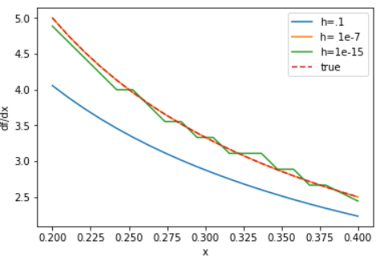
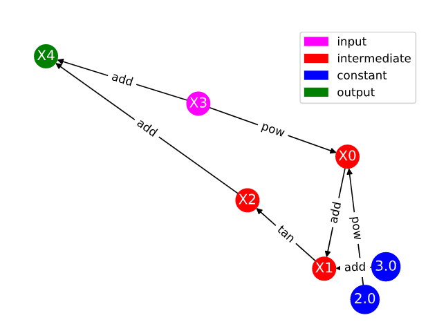

Solutions to Exercises
======================

Module 1
--------

Exercise 1: Motivating Automatic differentiation
^^^^^^^^^^^^^^^^^^^^^^^^^^^^^^^^^^^^^^^^^^^^^^^^

A. Here is an example python function:
::
        import numpy as np
        import matplotlib.pyplot as plt

        def numerical_diff(f, h):
            def num_der(x):
                return (f(x+h)-f(x))/h
            return num_der

        nd = numerical_diff(np.log, 1E-1)
        nd2 = numerical_diff(np.log, 1E-7)
        nd3 = numerical_diff(np.log, 1E-15)

        x = np.linspace(.2, .4, 20)

        plt.plot(x, nd(x), label = 'h=.1')
        plt.plot(x, nd2(x), label = 'h=1e-7')
        plt.plot(x, nd3(x), label = 'h=1e-15')
        plt.plot(x, 1/x, '--', label='true')
        plt.legend()
        plt.xlabel('x')
        plt.ylabel('df/dx')

B. The corresponding graph output is:

C.  The numerical differentiation performs best for h=1e-7.  For h too small, we encounter round off errors as a result of limited machine precision.  For h too large, the numerical approximation is not exact.  Automatic differentiation addresses this by evaluating derivatives exactly to machine precision without taking numerical estimates.

Exercise 2: Basic Graph Structure of Calculations
^^^^^^^^^^^^^^^^^^^^^^^^^^^^^^^^^^^^^^^^^^^^^^^^^

You should notice that while your labelling of the nodes may be different, the overall connectivity structure and edges should be the same.

Exercise 3: Looking Toward Multiple Inputs
^^^^^^^^^^^^^^^^^^^^^^^^^^^^^^^^^^^^^^^^^^

.. image:: Mod1Ex3Sol.PNG

Module 2
--------
Exercise 1: Neural Network Problem
^^^^^^^^^^^^^^^^^^^^^^^^^^^^^^^^^^

The corresponding computational graph is given by:

.. image:: Mod2Ex1Sol.png

The table corresponding to this graph is given by:

.. list-table::
        :widths: 5 20 20 20 20 20
        :header-rows: 1

        * - Trace
          - Elementary Function
          - Current Value
          - Elementary Function Derivative
          - :math:`\nabla_x` Evaluated at (x,y)
          - :math:`\nabla_y` Evaluated at (x,y)
        * - :math:`x_1`
          - :math:`x`
          - :math:`x`
          - 1
          - 1
          - 0
        * - :math:`x_2`
          - :math:`y`
          - :math:`y`
          - 1
          - 0
          - 1
        * - :math:`x_3`
          - :math:`w_{11} \times x_1`
          - :math:`w_{11}x`
          - :math:`w_{11}\dot{x_1}`
          - :math:`w_{11}`
          - 0
        * - :math:`x_4`
          - :math:`w_{21} \times x_1`
          - :math:`w_{21}x`
          - :math:`w_{21}\dot{x_1}`
          - :math:`w_{21}`
          - 0
        * - :math:`x_5`
          - :math:`w_{12} \times x_2`
          - :math:`w_{12}y`
          - :math:`w_{12}\dot{x_2}`
          - 0
          - :math:`w_{12}`
        * - :math:`x_6`
          - :math:`w_{22} \times x_2`
          - :math:`w_{22}y`
          - :math:`w_{22}\dot{x_2}`
          - 0
          - :math:`w_{22}`
        * - :math:`x_7`
          - :math:`x_3+x_5`
          - :math:`w_{11}x+w_{12}y`
          - :math:`\dot{x_3}+\dot{x_5}`
          - :math:`w_{11}`
          - :math:`w_{12}`
        * - :math:`x_8`
          - :math:`x_4+x_6`
          - :math:`w_{21}x+w_{22}y`
          - :math:`\dot{x_4}+\dot{x_6}`
          - :math:`w_{21}`
          - :math:`w_{22}`
        * - :math:`x_9`
          - :math:`z(x_7)`
          - :math:`z(w_{11}x+w_{12}y)`
          - :math:`z^\prime (x_7)\dot{x_7}`
          - :math:`z^\prime (w_{11}x+w_{12}y)w_{11}`
          - :math:`z^\prime (w_{11}x+w_{12}y)w_{12}`
        * - :math:`x_{10}`
          - :math:`z(x_8)`
          - :math:`z(w_{21}x+w_{22}y)`
          - :math:`z^\prime (x_8)\dot{x_8}`
          - :math:`z^\prime (w_{21}x+w_{22}y)w_{21}`
          - :math:`z^\prime (w_{21}x+w_{22}y)w_{22}`
        * - :math:`x_{11}`
          - :math:`w_{out,1}\times x_9`
          - :math:`w_{out,1}z(w_{11}x+w_{12}y)`
          - :math:`w_{out, 1}\dot{x_9}`
          - :math:`w_{out,1}z^\prime (w_{11}x+w_{12}y)w_{11}`
          - :math:`w_{out,1}z^\prime (w_{11}x+w_{12}y)w_{12}`
        * - :math:`x_{12}`
          - :math:`w_{out,2}\times x_{10}`
          - :math:`w_{out,2}z(w_{21}x+w_{22}y)`
          - :math:`w_{out, 2}\dot{x_{10}}`
          - :math:`w_{out,2}z^\prime (w_{21}x+w_{22}y)w_{21}`
          - :math:`w_{out,2}z^\prime (w_{21}x+w_{22}y)w_{22}`
        * - :math:`x_{13}`
          - :math:`x_{11}+x_{12}`
          - :math:`w_{out,1}z(w_{11}x+w_{12}y)+w_{out,2}z(w_{21}x+w_{22}y)`
          - :math:`\dot{x_{11}}+\dot{x_{12}}`
          - :math:`w_{out,1}z^\prime (w_{11}x+w_{12}y)w_{11}+w_{out,2}z^\prime (w_{21}x+w_{22}y)w_{21}`
          - :math:`w_{out,1}z^\prime (w_{11}x+w_{12}y)w_{12}+w_{out,2}z^\prime (w_{21}x+w_{22}y)w_{22}`
            

Exercise 2: Operation Count Problem
^^^^^^^^^^^^^^^^^^^^^^^^^^^^^^^^^^^
Computing the derivative at the six nodes :math:`x_3, x_4, x_5, x_6, x_{11}, x_{12}` requires one multiplication in each of the 2 components, contributing :math:`6 \times 1 \times 2 = 12` operations.

Computing the derivative at the 3 nodes :math:`x_7, x_8, x_{13}` requires one addition in each of the 2 components, contributing :math:`3\times 1 \times 2 = 6` operations.

Computing the derivative at the nodes :math:`x_9, x_{10}` requires 2 operations (an elementary function evaluation of :math:`z^\prime` and a multiplication) in each of the 2 components, contributing :math:`2\times 2 \times 2 = 8` operations.

This gives us a total of 26 operations.

Module 3
--------
Exercise 1: Reverse Mode Computational Table and Derivatives
^^^^^^^^^^^^^^^^^^^^^^^^^^^^^^^^^^^^^^^^^^^^^^^^^^^^^^^^^^^^

The reverse computational table is given by:

.. list-table::
        :widths: 5 10 10 10 10 10 10
        :header-rows: 1

        * - Node
          - Current Value
          - Numerical Value
          - :math:`\partial_1`
          - :math:`\partial_1` Value
          - :math:`\partial_2`
          - :math:`\partial_2` Value
        * - :math:`x_1`
          - :math:`x`
          - 1
          - 1
          - 1
          - 0
          - 0
        * - :math:`x_2`
          - :math:`y`
          - 2
          - 0
          - 0
          - 1
          - 1
        * - :math:`x_3`
          - :math:`x_1x_2`
          - 2
          - :math:`x_2`
          - 2
          - :math:`x_1`
          - 1
        * - :math:`x_4`
          - :math:`\exp(x_3)`
          - :math:`e^2`
          - :math:`\exp(x_3)`
          - :math:`e^2`
          - -
          - -
        * - :math:`x_5`
          - :math:`x_3+x_4`
          - 2+:math:`e^2`
          - 1
          - 1
          - 1
          - 1

We can now trace back through the table to find the adjoints.

.. math::
        \bar{x_5} = \frac{\partial f}{\partial x_5} = 1
        \bar{x_4} = \frac{\partial f}{\partial x_5}\frac{\partial x_5}{\partial x_4} = 1 \cdot 1 = 1
        \bar{x_3} = \frac{\partial f}{\partial x_4}\frac{\partial x_4}{\partial x_5}+\frac{\partial f}{\partial x_5}\frac{\partial x_5}{\partial x_3} = 1\cdot e^2 + 1\cdot 1 = 1+e^2
        \bar{x_2} = \frac{\partial f}{\partial x_3}\frac{\partial x_3}{\partial x_2} = (1+e^2)x_1 = 1+e^2
        \bar{x_1} = \frac{\partial f}{\partial x_3}\frac{\partial x_3}{\partial x_1} = (1+e^2)x_2 = 2+2e^2

We note that in our bar notation we have :math:`\bar{x_1} = \frac{\partial f}{\partial x}` and :math:`\bar{x_2} = \frac{\partial f}{\partial y}`.

Beyond the Basics
-----------------
Exercise 1: Dual Numbers
^^^^^^^^^^^^^^^^^^^^^^^^
To find the derivative, we look to the dual part when we replace x with :math:`a+b\epsilon`.  For our function,

.. math::
        y= e^{(a+b\epsilon)^2}
        = e^{a^2}e^{2ab\epsilon}e^{b^2\epsilon^2}

Since :math:`\epsilon^2=0`,

.. math::
        =e^{a^2}e^{2ab\epsilon}

Expanding :math:`e^{2ab\epsilon}` using a Taylor series,

.. math::
        = e^{a^2}\left( 1+ 2ab\epsilon + \frac{(2ab\epsilon)^2}{2} + \cdots \right)
        = e^{a^2}+2ae^{a^2}b\epsilon

So we have that the derivative evaluated at a is :math:`2ae^{a^2}`.

Exercise 2: Toy AD Example
^^^^^^^^^^^^^^^^^^^^^^^^^^

An example AutoDiffToy class could look like:      
::
      class AutoDiffToy():
          """ Creates an object for autodifferentiation.

          ATTRIBUTES
          ==========
          val : the value of the object
          der : the derivative of the object

          EXAMPLES
          ========
          >>> x = AutoDiffToy(4)
          >>> x.val
          4
          >>> x.der
          1
          """

          def __init__(self, a, d=1.0):
              self.val = a
              self.der = d

          def __add__(self, other): #overload addition
              try:
                  return AutoDiffToy(self.val+other.val, self.der+other.der)
              except AttributeError:
                  other = AutoDiffToy(other, 0) # derivative of a constant is zero
                  return AutoDiffToy(self.val+other.val, self.der+other.der)

          def __radd__(self, other): #ensure commutativity of addition
              return self.__add__(other)

          def __mul__(self, other): #overload multiplication
              try:
                  return AutoDiffToy(self.val*other.val, self.val*other.der+other.val*self.der)
              except AttributeError:
                  other = AutoDiffToy(other, 0)
                  return AutoDiffToy(self.val*other.val, self.val*other.der+other.val*self.der)

            def __rmul__(self, other):
              return self.__mul__(other)
