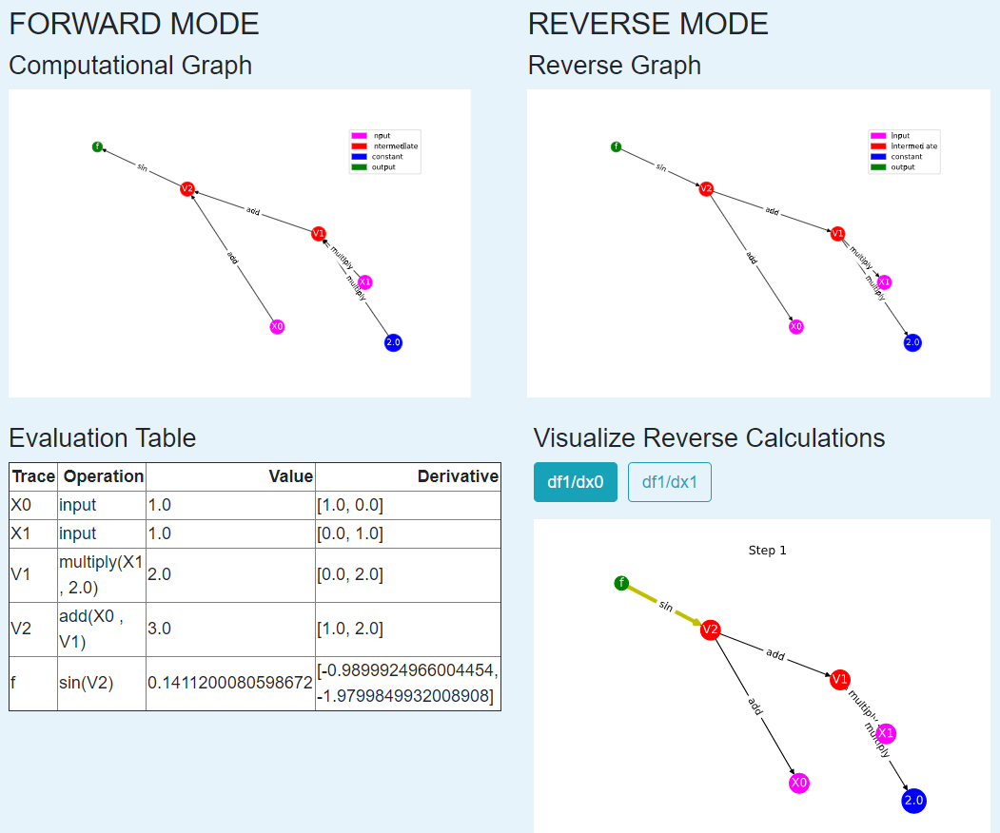

# Summary
Most fields of scientific inquiry require the evaluation of derivatives to calculate and optimize quantities of interest.
Automatic differentiation is a set of techniques that allow the differentiation of computer programs to machine precision
without requiring full symbolic derivatives [@griewank1989automatic; @baydin2017automatic]. The great success of machine
learning algorithms, and neural networks in particular, was partly enabled by the celebrated backpropagation algorithm
[@werbos1990backpropagation], which is a special case of automatic differentiation. Given the rapidly increasing interest in
algorithms that rely on automatic differentiation, and the evolution towards differential programming paradigms
[@innes2019differentiable], it is important that students be taught the basics of this key family of algorithms.

<!--Recent research has shown the growing power of machine learning to analyze data, build models, and
predict outcomes, particularly through the use of neural networks.  Automatic differentiation is the basic concept underlying
the backpropagation algorithm, typically employed to fit these neural networks.  However, automatic differentiation is not
limited to this application but is a powerful computational tool for a range of applications, making it important for
students to understand the basics of automatic differentiation.-->

Automatic differentiation is a method of computing derivatives to machine precision based on the decomposition of functions
into a series of elementary operations. These operations can be conceptualized as forming a graph structure. This graph can
be traversed in the forward or reverse direction, giving rise to the two primary modes in automatic differentiation. The goal
of the `Auto-eD` software and the accompanying lecture modules is to enhance students' understanding of automatic
differentiation by helping them to visualize the underlying graph structure of the computations.

# Statement of Need
While most students encountering automatic differentiation will be familiar with the chain rule from multivariable calculus,
far fewer students understand how to relate the chain rule to methods for computing derivatives in software. The fundamental
step to this understanding is the ability to decompose a function into elementary operations and traverse the resulting graph
structure. The `Auto-eD` software and lecture modules provide a framework for educators to help teach students how to relate
functions to an underlying graph and use that graph to compute derivatives. Using `Auto-eD`, students are able to visualize
the forward and reverse graph and an accompanying computational trace table. As a result, students gain a better
understanding of the process of automatic differentiation and hence are better equipped to understand its use in a wide range
of applications.

# Content
The content available in the [Auto-eD package](https://github.com/lindseysbrown/Auto-eD) contains a software package capable
of performing automatic differentiation for a function and visualizing this calculation in a table and graphs. Additionally,
the `Auto-eD` package content contains a learning unit for teaching automatic differentiation through an easily-accessible
web application based on this software.

This module provides content for students at three different levels of experience.  Advanced students, familiar with both coding
and automatic differentiation, may use the `Auto-eD` package as described in Auto-eD Visualization Softward.  Students who have
learned the principles behind automatic differentiation but are less comfortable with coding can test and enhance their understanding 
by using the [web application](https://autoed.herokuapp.com) as described in Web Application.  Students who are new to automatic 
differentiation and want to learn this concept should work through the automatic differentiation unit (available on 
[Read the Docs](https://auto-ed.readthedocs.io/en/latest), which includes excerises and tutorials using the web application, as 
described in Accompanying Automatic Differentiation Unit.

## Auto-eD Visualization Software
The `Auto-eD` package can be accessed using two different methods. For students more familiar with Python and coding, the
code available in the modules `ADnum.py`, `ADmath.py`, and `ADgraph.py` allows a user to perform automatic differentiation
while visualizing the underlying graphs and computations. These modules provide the functionality to visualize the graphs
underlying forward and reverse mode. An experienced user can write a Python script that imports these modules and provides
the capability to dynamically visualize the traceback of reverse mode through the graph. The resulting graphs and tables can
be resized for enhanced interactivity. The process is outlined in `DeveloperDocumentation.ipynb`, which can be found at the
top level of the Auto-eD package.  This package underlies the web-based visualization tool for students less familiar with 
Python and coding.

## Auto-eD Web Application

This software and associated web application are valuable pedagogical tools because they allow students to view the
computational graph in both forward and reverse mode alongside the computational table. This makes it easy for students to
relate the table and the graph as well as compare the differences in graph traversal of the forward and reverse mode. An
example output from the web application is below. The first row shows the computational graphs for the forward (left) and
reverse (right) modes of automatic differentiation. The table in the second row shows the values of the function and it's
derivative at a specified evaluation point at each step of the graph. The figure in the bottom right shows a snapshot of an
interactive visualization that enables the user to systematically step through each step of reverse mode. The current step is
highlighted with a bold, yellow arrow.

For ease of instructional use for students less familiar with Python and coding, `Auto-eD` is available as a [web
application](https://autoed.herokuapp.com). If the web application is slow to load, it can alternatively be run locally by
downloading the code from Github and launching `ADapp.py` from the command line. To make sure this final option is still
accessible to students with limited coding experience, the code documentation, contained in `DeveloperDocumentation.ipynb`
provides detailed steps on how to launch locally.

For more advanced users and developers interested in further modifications of the package, the Github repository can also be
cloned. Full details for use of the package outside of the web app are also available in `DeveloperDocumentation.ipynb`.

Finally, for users interested in learning more about the underlying theory of automatic differentiation, the software is
complemented by an accompanying automatic differentiation unit.

## Accompanying Automatic Differentiation Unit

This software package is accompanied by a series of learning modules available on [Read the
Docs](https://auto-ed.readthedocs.io/en/latest) to help students understand the theory behind automatic differentiation that
is performed and visualized by the package. In the first module, we motivate the need for automatic differentiation, contrast
it with numeric and symbolic differentiation, and introduce the basics of forward mode for a single-input, single-output
function. In the second module, we expand on the first module to include more of the theory underlying the forward mode,
including a consideration of multiple input variables. We also emphasize the computational table and the graph structure in
more detail. The third module introduces the reverse
mode of automatic differentiation and connects it to the famous backpropagation algorithm. The fourth module concludes with a
series of possible extensions and a discussion of how automatic differentiation might be performed in software. The fourth
module has been used to help students focus their final software development project. Each module is accompanied by a series
of exercises, where manual exercises are complemented with the `Auto-eD` web application.

## Experience of Use
A similar structure of course modules has been used to teach these concepts in the CS107/CS207/AC207 class at the Institute
for Applied Computational Science at Harvard since Fall 2018. In Fall 2019, the course introduced a GUI based on portions of
this software to help students with the graph visualization, which received positive feedback from students taking the
course. This GUI has since been refactored for the web interface, making it more accessible across different operating
systems. Students in the Fall 2020 class used web application and responses were positive.

## Learning Objectives
Upon completion of this unit, students should be able to:
- Explain why automatic differentiation is a valuable computational tool
- Decompose a function into a series of elementary operations and write out the associated graph structure
- Perform automatic differentiation for functions of single and multiple variables in the forward and reverse mode
- Start thinking about how to implement the forward mode of automatic differentiation in software

# Acknowledgements
The authors thank Xinyue Wang and Kevin Yoon, who contributed to the original code base developed for forward mode for the
Harvard CS207 course project in Fall 2018.

# References
